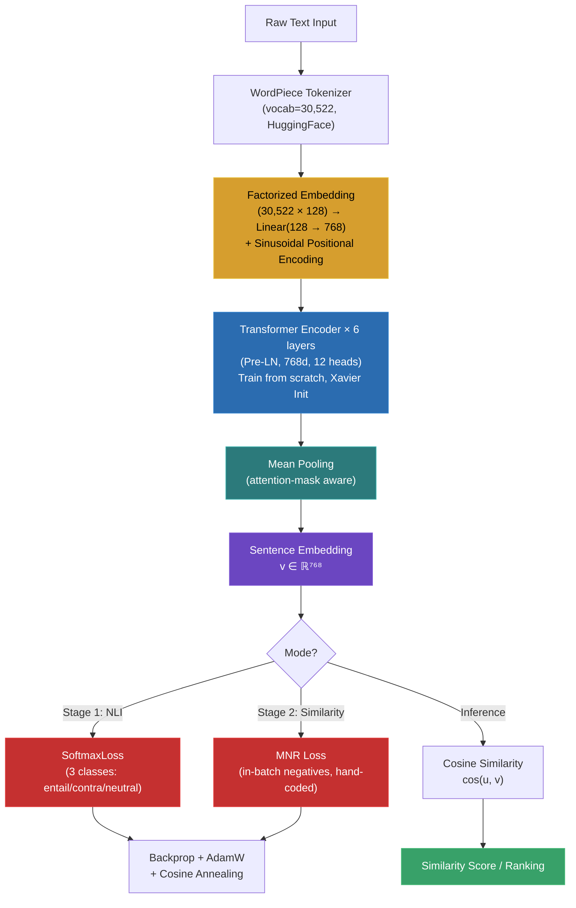

# Nghiên cứu: Hệ thống Document Similarity dựa trên Transformer (v2)

> [!NOTE]
> **Bản v2** — Đã sửa đổi dataset training (loại MS MARCO, thay bằng dataset symmetric similarity phù hợp), bổ sung workflow MPS/CUDA, xác minh lại toàn bộ kiến trúc.
> Tất cả bài báo trích dẫn đều **đã qua peer-review** tại hội nghị/tạp chí uy tín. Không có preprint.

---


## 1. Ứng dụng thực tế cho bài toán Document Similarity

Bài toán "tìm văn bản tương tự" có thể áp dụng vào nhiều lĩnh vực thực tế:

| Ứng dụng | Mô tả | Độ khả thi cho đồ án |
|:---|:---|:---|
| **Phát hiện đạo văn (Plagiarism Detection)** | So sánh bài luận/bài báo với corpus để tìm đoạn copy/paraphrase | ⭐⭐⭐ Rất phù hợp |
| **Semantic Search** | Tìm kiếm tài liệu theo ý nghĩa, không chỉ từ khóa | ⭐⭐⭐ Rất phù hợp |
| **Phát hiện câu hỏi trùng lặp** | Giống Quora — gộp câu hỏi có cùng ý nghĩa | ⭐⭐⭐ Rất phù hợp |
| **Hệ thống gợi ý bài viết/tin tức** | Gợi ý bài viết liên quan dựa trên nội dung | ⭐⭐ Phù hợp |
| **So khớp hồ sơ pháp lý/bằng sáng chế** | Tìm án lệ/bằng sáng chế tương tự | ⭐⭐ Phù hợp (cần domain data) |

> [!TIP]
> **Đề xuất:** Chọn **Phát hiện đạo văn**, **Semantic Search**, hoặc **Phát hiện câu hỏi trùng lặp** — có dataset phong phú, dễ đánh giá định lượng, và thể hiện rõ sức mạnh của Transformer.

---

## 2. Nền tảng lý thuyết — Các bài báo kinh điển (20-30+ năm)

### 2.1 Vector Space Model (VSM)

- **Bài báo:** Salton, G., Wong, A., & Yang, C.S. (1975). *"A Vector Space Model for Automatic Indexing."* **Communications of the ACM**, 18(11), 613–620.
- **Ý tưởng:** Biểu diễn mỗi document là vector trong không gian từ vựng. Tính similarity bằng **cosine similarity**.
- **Hạn chế:** Dựa hoàn toàn vào tần suất từ (TF-IDF), không hiểu ngữ nghĩa. "Xe hơi" và "ô tô" được coi là hoàn toàn khác nhau.

### 2.2 Latent Semantic Analysis (LSA)

- **Bài báo:** Deerwester, S., Dumais, S.T., Furnas, G.W., Landauer, T.K., & Harshman, R. (1990). *"Indexing by Latent Semantic Analysis."* **Journal of the American Society for Information Science (JASIS)**, 41(6), 391–407.
- **Ý tưởng:** Dùng **SVD** để giảm chiều ma trận term-document, phát hiện "khái niệm ẩn" (latent concepts). Các từ đồng nghĩa được gom lại trong không gian ẩn.
- **Ý nghĩa:** LSA là tiền thân của ý tưởng "embedding" — biểu diễn văn bản trong không gian thấp chiều.

### 2.3 BM25

- **Bài báo:** Robertson, S.E. & Zaragoza, H. (2009). *"The Probabilistic Relevance Framework: BM25 and Beyond."* **Foundations and Trends in Information Retrieval**, 3(4), 333–389.
- **Ý tưởng:** Cải tiến TF-IDF bằng mô hình xác suất, chuẩn hóa độ dài tài liệu, kiểm soát saturation của term frequency.
- **Ý nghĩa:** BM25 là **baseline bắt buộc phải so sánh**. Bất kỳ hệ thống deep learning nào cũng cần chứng minh vượt BM25.

---

## 3. Word Embeddings — Bước trung gian (10+ năm)

### 3.1 Word2Vec

- **Bài báo:** Mikolov, T., Sutskever, I., Chen, K., Corrado, G.S., & Dean, J. (2013). *"Distributed Representations of Words and Phrases and their Compositionality."* **NeurIPS 2013**.
- **Ý tưởng:** Skip-gram / CBOW — học vector cho từng từ dựa trên ngữ cảnh xuất hiện.
- **Hạn chế cho similarity:** Tạo embedding cho **từ**, không phải **câu/document**. Average word embeddings mất thông tin ngữ cảnh và trật tự từ.

### 3.2 GloVe

- **Bài báo:** Pennington, J., Socher, R., & Manning, C.D. (2014). *"GloVe: Global Vectors for Word Representation."* **EMNLP 2014**.
- **Ý tưởng:** Kết hợp matrix factorization (LSA) và local context (Word2Vec). Factorize ma trận co-occurrence toàn cục.

### 3.3 Doc2Vec (Paragraph Vector)

- **Bài báo:** Le, Q. & Mikolov, T. (2014). *"Distributed Representations of Sentences and Documents."* **ICML 2014**.
- **Ý tưởng:** Mở rộng Word2Vec — thêm "paragraph ID" vector được huấn luyện cùng word vectors.
- **Hạn chế:** Hiệu suất không ổn định, khó reproduce, đã bị vượt qua bởi Transformer.

---

## 4. Kiến trúc Transformer — Cốt lõi

### 4.1 Self-Attention Mechanism

- **Bài báo:** Vaswani, A., Shazeer, N., Parmar, N., Uszkoreit, J., Jones, L., Gomez, A.N., Kaiser, Ł., & Polosukhin, I. (2017). *"Attention Is All You Need."* **NeurIPS 2017**.

**Scaled Dot-Product Attention:**

```
Attention(Q, K, V) = softmax(Q · Kᵀ / √d_k) · V
```

- **Q** (Query), **K** (Key), **V** (Value): tính từ input qua linear projections
- **√d_k**: hệ số scaling — ngăn dot product quá lớn khiến softmax bão hòa
- Mỗi token "chú ý" đến tất cả token khác → nắm bắt long-range dependencies

**Multi-Head Attention:**

```
MultiHead(Q, K, V) = Concat(head_1, ..., head_h) · W_O
head_i = Attention(Q·W_Q_i, K·W_K_i, V·W_V_i)
```

- Mỗi head học một "góc nhìn" khác nhau (cú pháp, ngữ nghĩa, vị trí, ...)
- Số head điển hình: 12 (BERT-base), chiều mỗi head = 768/12 = 64

> [!IMPORTANT]
> **Tại sao Self-Attention quan trọng cho Document Similarity:**
> Mỗi token "nhìn" được tất cả token khác → từ "bank" trong "river bank" vs "bank account" có representation khác nhau nhờ attention đến ngữ cảnh. Đây là lý do Transformer vượt trội RNN/LSTM cho bài toán hiểu ngữ nghĩa.

### 4.2 Transformer Encoder Block

```
Input
  ↓
[Multi-Head Self-Attention] → Add & LayerNorm (residual connection)
  ↓
[Feed-Forward Network]      → Add & LayerNorm (residual connection)
  ↓
Output
```

- **FFN:** 2 linear layers + GELU activation: `FFN(x) = GELU(x·W₁ + b₁)·W₂ + b₂`
- **d_ff** = 4 × d_model (3072 khi d_model = 768)

### 4.3 BERT — Pre-trained Encoder

- **Bài báo:** Devlin, J., Chang, M.W., Lee, K., & Toutanova, K. (2019). *"BERT: Pre-training of Deep Bidirectional Transformers for Language Understanding."* **NAACL 2019**.

| Cấu hình | BERT-base | BERT-large |
|:---|:---|:---|
| Layers | 12 | 24 |
| Hidden size (d_model) | 768 | 1024 |
| Attention heads | 12 | 16 |
| Parameters | ~110M | ~340M |
| FFN size | 3072 | 4096 |

**Pre-training:**
1. **Masked Language Model (MLM):** Che 15% tokens, dự đoán token bị che → học biểu diễn bidirectional
2. **Next Sentence Prediction (NSP):** Dự đoán hai câu có liền kề không

> [!WARNING]
> **BERT gốc KHÔNG phù hợp cho document similarity trực tiếp:**
> - Yêu cầu cross-encoding — cặp (doc_A, doc_B) vào cùng 1 forward pass
> - So sánh 10.000 tài liệu cần ~65 giờ (Reimers & Gurevych, 2019)
> - Giải pháp: **Bi-Encoder / Siamese Network** (phần 5)

---

## 5. Kiến trúc đề xuất: Bi-Encoder Siamese Transformer

### 5.1 Sentence-BERT (SBERT) — Bài báo nền tảng

- **Bài báo:** Reimers, N. & Gurevych, I. (2019). *"Sentence-BERT: Sentence Embeddings using Siamese BERT-Networks."* **EMNLP-IJCNLP 2019**.

#### Kiến trúc Inference:

```
Document A ───→ [Transformer Encoder] ───→ [Pooling] ──→ u
                     (chia sẻ trọng số — Siamese)
Document B ───→ [Transformer Encoder] ───→ [Pooling] ──→ v

                  Similarity = cosine(u, v)
```

#### Kiến trúc Training:

```
┌─────────────────────────────────────────────────────────────┐
│ NLI Training (Giai đoạn 1):                                 │
│                                                             │
│   Sentence A ──→ [Encoder] ──→ [Pooling] ──→ u             │
│   Sentence B ──→ [Encoder] ──→ [Pooling] ──→ v             │
│                                                             │
│        concat(u, v, |u-v|) → [Softmax 3 classes] → CE Loss │
│        (entailment / contradiction / neutral)               │
└─────────────────────────────────────────────────────────────┘

┌─────────────────────────────────────────────────────────────┐
│ Similarity Training (Giai đoạn 2):                          │
│                                                             │
│   Doc A ──→ [Encoder] ──→ [Pooling] ──→ u                  │
│   Doc B ──→ [Encoder] ──→ [Pooling] ──→ v                  │
│                                                             │
│        cosine_sim(u, v) → MNR Loss (in-batch negatives)     │
└─────────────────────────────────────────────────────────────┘
```

#### Điểm mấu chốt:
- Hai encoder **chia sẻ trọng số** (Siamese) → chỉ 1 bộ tham số
- Mỗi document được encode **độc lập** → pre-compute embeddings
- So sánh 10.000 tài liệu: **~5 giây** (vs 65 giờ cross-encoder)

### 5.2 Chiến lược Pooling

| Phương pháp | Công thức | Hiệu quả |
|:---|:---|:---|
| **Mean Pooling** ✅ | `v = mean(h₁, h₂, ..., hₙ)` (mask padding) | ⭐⭐⭐ Tốt nhất (SBERT paper) |
| [CLS] Token | `v = h_CLS` | ⭐⭐ Khá tốt khi fine-tune đúng |
| Max Pooling | `v = max(h₁, ..., hₙ)` theo từng chiều | ⭐ Kém hơn |

```python
# Mean Pooling chuẩn (pseudocode)
def mean_pooling(token_embeddings, attention_mask):
    mask_expanded = attention_mask.unsqueeze(-1).float()
    sum_embeddings = (token_embeddings * mask_expanded).sum(dim=1)
    sum_mask = mask_expanded.sum(dim=1).clamp(min=1e-9)
    return sum_embeddings / sum_mask
```

---

## 6. Hàm Loss

### 6.1 Multiple Negatives Ranking Loss (MNR) — KHUYẾN NGHỊ

**Cơ chế In-Batch Negatives:**
```
Batch: {(a₁, p₁), (a₂, p₂), ..., (aₙ, pₙ)}

Với anchor aᵢ:
  positive = pᵢ
  negatives = {p₁, ..., pᵢ₋₁, pᵢ₊₁, ..., pₙ}

L = -log( exp(sim(aᵢ, pᵢ) / τ) / Σⱼ exp(sim(aᵢ, pⱼ) / τ) )
```

**Ưu điểm:**
- Chỉ cần **(anchor, positive)** pairs — không cần label negative tường minh
- Batch lớn → nhiều negatives → model mạnh hơn
- Negatives "miễn phí" từ batch — cực kỳ hiệu quả compute

> [!TIP]
> Nếu VRAM giới hạn batch size, dùng **CachedMultipleNegativesRankingLoss** (sentence-transformers) để mô phỏng batch size lớn mà không tăng VRAM.

### 6.2 SimCSE — Unsupervised Contrastive

- **Bài báo:** Gao, T., Yao, X., & Chen, D. (2021). *"SimCSE: Simple Contrastive Learning of Sentence Embeddings."* **EMNLP 2021**.
- **Ý tưởng:** Dùng **dropout** như data augmentation — đưa cùng 1 câu qua encoder 2 lần với dropout khác nhau → positive pair. Các câu khác trong batch → negatives.
- **Khi nào dùng:** Pre-train unsupervised trước khi supervised fine-tune, hoặc khi thiếu labeled data.

### 6.3 AnglE/AoE — Hướng tiếp cận mới nhất (2024)

- **Bài báo:** Li, X. & Li, J. (2024). *"AnglE-optimized Text Embeddings."* **ACL 2024**.
- **Vấn đề:** Cosine similarity loss có **vùng bão hòa** — khi cos(θ) gần 0 hoặc ±1, gradient ≈ 0.
- **Giải pháp:** Biểu diễn embeddings như **complex vectors** (phần thực + phần ảo), tối ưu angle difference trong complex space.
- **Ý nghĩa cho đồ án:** Đây là contribution **mới nhất** (ACL 2024) — rất phù hợp để so sánh với MNR Loss.

---

## 7. Dataset huấn luyện — ĐÃ SỬA so với v1

> [!CAUTION]
> **Thay đổi quan trọng so với v1:** Loại bỏ **MS MARCO** khỏi training pipeline. MS MARCO là dataset **asymmetric retrieval** (query ngắn → passage dài), không phù hợp cho bài toán **symmetric document similarity** (doc ↔ doc cùng vai trò).

### 7.1 Dataset Training — Symmetric Similarity

| Dataset | Kích thước | Loại | Venue (peer-reviewed) | Vai trò |
|:---|:---|:---|:---|:---|
| **AllNLI** | ~1M pairs | NLI (entailment/contradiction/neutral) | SNLI: Bowman et al., **EMNLP 2015** + MultiNLI: Williams et al., **NAACL 2018** | Giai đoạn 1: NLI fine-tune |
| **ParaNMT-50M** | **50M+ pairs** | Paraphrase (symmetric) | Wieting & Gimpel, **ACL 2018** | **Giai đoạn 2: chính** |
| **QQP** | ~404K pairs | Duplicate questions (symmetric) | Trong GLUE benchmark: Wang et al., **ICLR 2019** | Giai đoạn 2: bổ sung |
| **PAWS** | ~108K labeled + ~656K noisy | Adversarial paraphrase | Zhang et al., **NAACL 2019** | Giai đoạn 2: hard negatives |
| **HEADLINES** | **~400M pairs** | Headline similarity (symmetric) | Silcock et al., **NeurIPS 2023** | Tùy chọn: scale cực lớn |

### 7.2 Dataset Evaluation

| Dataset | Kích thước | Metric | Venue |
|:---|:---|:---|:---|
| **STS Benchmark** | ~8.6K pairs (scores 0-5) | Spearman correlation | Cer et al., **SemEval@ACL 2017** |
| **QQP test set** | ~40K pairs | F1 / Accuracy | Wang et al., **ICLR 2019** |
| **PAWS test set** | ~8K pairs | Accuracy (adversarial) | Zhang et al., **NAACL 2019** |

### 7.3 Chi tiết về ParaNMT-50M — Dataset chính

> [!WARNING]
> **Cảnh báo chất lượng:** ParaNMT-50M được tạo tự động bằng neural machine translation (back-translation Czech→English). Do đó:
> - Có **noise** — một số cặp không phải paraphrase thực sự
> - Cần **lọc dữ liệu** trước khi training: dùng length-normalized translation scores, trigram overlap, hoặc paraphrase scores
> - **Khuyến nghị:** Lọc lấy **subset 5-10M cặp chất lượng cao** thay vì dùng toàn bộ 50M
> - Dù có noise, đây vẫn là dataset paraphrase lớn nhất có peer-review, và SBERT paper gốc đã chứng minh hiệu quả

### 7.4 Chi tiết về PAWS — Hard Negatives

PAWS đặc biệt giá trị vì chứa các cặp câu có **lexical overlap cao nhưng KHÔNG phải paraphrase**:
```
✅ Paraphrase:     "Flights from NYC to LA" ↔ "Flights from LA to NYC"  → KHÁC nghĩa!
❌ Không phải:     "He ate the cake" ↔ "The cake ate him"               → KHÁC nghĩa!
```

Model phải hiểu **cấu trúc và ngữ nghĩa**, không chỉ word overlap → buộc Transformer tận dụng self-attention.

### 7.5 Tại sao loại MS MARCO

| | MS MARCO (loại) | ParaNMT + QQP + PAWS (dùng) |
|:---|:---|:---|
| **Tính chất** | Asymmetric (query ≠ passage) | **Symmetric** (doc ↔ doc) ✅ |
| **Bài toán** | Information Retrieval | **Document Similarity** ✅ |
| **Quy mô** | 8.8M passages | 50M+ (ParaNMT) ✅ |
| **Giải trình hội đồng** | Khó giải thích | Rõ ràng, trực tiếp ✅ |

---

## 8. Pipeline Training — Sửa lại

```
┌────────────────────────────────────────────────────────────────┐
│ Giai đoạn 1: NLI Fine-tune                                     │
│                                                                │
│ Dataset:   AllNLI (~1M pairs)                                  │
│ Loss:      Softmax (3 classes: entailment/contradiction/neutral)│
│ Objective: concat(u, v, |u-v|) → classifier → cross-entropy   │
│ Mục tiêu:  Học phân biệt ngữ nghĩa tổng quát                 │
│ Epochs:    3-5                                                 │
│                                                                │
│ Thời gian:  ~30-45 phút (A100) | ~3-4 giờ (T4) | debug (MPS)  │
└────────────────────────┬───────────────────────────────────────┘
                         ↓
┌────────────────────────────────────────────────────────────────┐
│ Giai đoạn 2: Similarity Fine-tune                              │
│                                                                │
│ Dataset:   ParaNMT-50M filtered subset (~5-10M pairs)          │
│          + QQP (~404K pairs)                                   │
│          + PAWS (~108K pairs — hard negatives)                 │
│ Loss:      MNR Loss (in-batch negatives)                       │
│            hoặc AnglE Loss (để so sánh — ACL 2024)             │
│ Mục tiêu:  Tối ưu document ↔ document similarity              │
│ Epochs:    1-2 (ParaNMT) + 3-5 (QQP+PAWS)                     │
│                                                                │
│ Thời gian:  ~2-3 giờ (A100) | ~8-12 giờ (T4) | debug (MPS)    │
└────────────────────────┬───────────────────────────────────────┘
                         ↓
┌────────────────────────────────────────────────────────────────┐
│ Evaluation                                                     │
│                                                                │
│ • STS Benchmark → Spearman correlation                         │
│ • QQP test set  → F1 score                                    │
│ • PAWS test set → Accuracy (adversarial)                       │
│ • MTEB subset   → Tổng hợp nhiều task                         │
└────────────────────────────────────────────────────────────────┘
```

**Tổng thời gian training trên A100: ~3-4 giờ** → 1 session Colab dư sức.

---

## 9. Kiến trúc Model cụ thể

### 9.1 Phương án 1: Fine-tune BERT-base (KHUYẾN NGHỊ)

```
┌────────────────────────────────────────────────────────────┐
│  Input: "The quick brown fox jumps over the lazy dog"      │
│          ↓                                                 │
│  [WordPiece Tokenizer] (vocab: 30,522)                     │
│          ↓                                                 │
│  ┌──────────────────────────────────────────┐              │
│  │    Token Embedding  (30,522 × 768)       │              │
│  │  + Position Embedding (512 × 768)        │              │
│  │  + Segment Embedding  (2 × 768)          │              │
│  │  → LayerNorm + Dropout(0.1)              │              │
│  └──────────────────┬───────────────────────┘              │
│                     ↓                                      │
│  ┌──────────────────────────────────────────┐              │
│  │    Transformer Encoder × 12 layers        │              │
│  │    ┌─────────────────────────────────┐    │              │
│  │    │ Multi-Head Self-Attention        │    │              │
│  │    │ 12 heads, d_k=d_v=64            │    │              │
│  │    └────────────┬────────────────────┘    │              │
│  │                 ↓ + Residual + LayerNorm  │              │
│  │    ┌─────────────────────────────────┐    │              │
│  │    │ FFN (768 → 3072 → 768)          │    │              │
│  │    │ Activation: GELU                │    │              │
│  │    └────────────┬────────────────────┘    │              │
│  │                 ↓ + Residual + LayerNorm  │              │
│  └──────────────────┬───────────────────────┘              │
│                     ↓                                      │
│  [Mean Pooling] (attention-mask aware)                     │
│                     ↓                                      │
│  Sentence Embedding ∈ ℝ⁷⁶⁸                               │
└────────────────────────────────────────────────────────────┘
```

| Thông số | Giá trị |
|:---|:---|
| Tổng tham số | ~110M |
| Embedding đầu ra | 768 chiều |
| Max sequence length | 512 tokens |
| VRAM training (batch=16, seq=256) | ~4-6 GB |
| VRAM training (batch=32, seq=128) | ~4-6 GB |

**→ Thoải mái fit trong 8-12 GB VRAM máy cá nhân.**

### 9.2 Phương án 2: Efficient Custom Transformer — Train From Scratch (CHỌN)

> [!IMPORTANT]
> **Bản v3 — Quyết định cuối cùng:** Thay vì fine-tune BERT (blackbox), chúng ta sẽ **tự implement toàn bộ kiến trúc Transformer bằng PyTorch thuần** (không dùng thư viện HuggingFace Transformers hay sentence-transformers). Mục tiêu: hiểu bản chất từng phép toán, chứng minh năng lực kỹ thuật trước hội đồng, và thiết kế kiến trúc nhỏ-hiệu quả thay vì bóp nhỏ kiến trúc lớn.

#### Triết lý thiết kế: Shallow-Wide Factorized Transformer (SWFT)

Đây **không phải bản thu nhỏ của BERT**. Đây là kiến trúc được thiết kế lại từ gốc với 3 nguyên tắc:

1. **Factorized Embedding** (từ ALBERT, ICLR 2020): Phân rã ma trận Embedding khổng lồ thành 2 bước nhỏ → tiết kiệm hàng chục triệu tham số.
2. **Shallow & Wide** (Nông nhưng Rộng): Ít layers (giảm FLOPs tuần tự) nhưng hidden dimension lớn (giữ biểu diễn phong phú).
3. **Pre-LN** (từ Xiong et al., ICML 2020): Đặt LayerNorm trước sub-layer thay vì sau → ổn định gradient, giảm phụ thuộc warmup.

```
┌────────────────────────────────────────────────────────────┐
│  Input: "The quick brown fox jumps over the lazy dog"      │
│          ↓                                                 │
│  [WordPiece Tokenizer] (vocab: 30,522)                     │
│          ↓                                                 │
│  ┌──────────────────────────────────────────┐              │
│  │  FACTORIZED EMBEDDING (ALBERT-style)     │              │
│  │                                          │              │
│  │  Token ID → Embedding(30,522 × 128)      │ ← Bước 1    │
│  │         → Linear(128 → 768)              │ ← Bước 2    │
│  │  + Sinusoidal Position Encoding (256×768) │              │
│  │  → LayerNorm + Dropout(0.1)              │              │
│  └──────────────────┬───────────────────────┘              │
│                     ↓                                      │
│  ┌──────────────────────────────────────────┐              │
│  │  Transformer Encoder × 6 layers (PRE-LN) │              │
│  │  ┌─────────────────────────────────┐      │              │
│  │  │ LayerNorm                       │      │              │
│  │  │       ↓                         │      │              │
│  │  │ Multi-Head Self-Attention       │      │              │
│  │  │ 12 heads, d_k = d_v = 64       │      │              │
│  │  │       ↓ + Residual              │      │              │
│  │  │ LayerNorm                       │      │              │
│  │  │       ↓                         │      │              │
│  │  │ FFN (768 → 3072 → 768)         │      │              │
│  │  │ Activation: GELU               │      │              │
│  │  │       ↓ + Residual              │      │              │
│  │  └─────────────────────────────────┘      │              │
│  └──────────────────┬───────────────────────┘              │
│                     ↓                                      │
│  [Mean Pooling] (attention-mask aware)                     │
│                     ↓                                      │
│  Sentence Embedding ∈ ℝ⁷⁶⁸                               │
└────────────────────────────────────────────────────────────┘
```

| Thông số | BERT-base (tham khảo) | SWFT (của chúng ta) | Lý do |
|:---|:---|:---|:---|
| Layers | 12 | **6** | Giảm FLOPs tuần tự 2x, tiết kiệm compute |
| Hidden size (d_model) | 768 | **768** | Giữ nguyên chiều output embedding phong phú |
| Attention heads | 12 | **12** | Giữ nguyên để đa dạng "góc nhìn" ngữ nghĩa |
| FFN size | 3072 | **3072** | Giữ tỷ lệ 4× chuẩn Transformer |
| Embedding dim (E) | 768 (=H) | **128** | Factorized: tiết kiệm ~19M tham số |
| Norm | Post-LN | **Pre-LN** | Ổn định gradient, giảm warmup |
| Position | Learned | **Sinusoidal** | Không thêm tham số, generalize tốt |
| Tổng tham số | ~110M | **~25-30M** | Giảm 3-4× |
| VRAM training (batch=32) | ~6 GB | **~2-3 GB** | Fit thoải mái trên mọi GPU |

> [!TIP]
> **Tại sao giữ d_model = 768 thay vì giảm?** Embedding output dimension quyết định khả năng phân biệt ngữ nghĩa tinh tế (fine-grained similarity). Vector 256 chiều quá ngắn → không gian biểu diễn bị nghẽn (bottleneck), mô hình không thể "chứa" được tri thức từ hàng triệu câu. Giữ 768 chiều = giữ sức mạnh biểu diễn của BERT, nhưng giảm compute bằng cách cắt depth.

### 9.3 Phương án đề xuất: Kết hợp thí nghiệm (Curriculum Learning)

Với ngân sách 20-25 USD (tương đương ~10 giờ chạy H100 80GB), chúng ta có đủ compute để xử lý **hàng chục GB dữ liệu** (hàng chục triệu câu). Do huấn luyện từ đầu (from scratch), mô hình cần học biểu diễn ngôn ngữ cơ bản trước khi tinh chỉnh.

```
Thí nghiệm 0: BM25 baseline                         ← Giới hạn lexical matching
Thí nghiệm 1: SWFT + Unsupervised SimCSE (Stage 0)  ← Pre-train trên 20GB Wikipedia
Thí nghiệm 2: SWFT + SoftmaxLoss (Stage 1 - NLI)    ← Học phân biệt ngữ nghĩa
Thí nghiệm 3: SWFT + MNR Loss (Stage 2 - PAWS)      ← Contrastive Learning + Hard Negatives
```

---

## 10. Hyperparameters

### 10.1 Train From Scratch (SWFT)

| Hyperparameter | Giá trị | Ghi chú | Paper tham khảo |
|:---|:---|:---|:---|
| Learning rate | 5e-4 | Cao hơn fine-tune vì train from scratch | BERT paper Section 10 |
| Warmup | 10% tổng steps | Linear warmup | Vaswani et al. 2017 |
| Scheduler | **Cosine Annealing** | Hội tụ tốt hơn linear decay | Loshchilov & Hutter, ICLR 2017 |
| Batch size (effective) | 128-256 | Gradient accumulation nếu cần | |
| Batch size (per GPU) | 32-64 | Trên H100 80GB VRAM | |
| Weight decay | 0.01 | AdamW | Loshchilov & Hutter, ICLR 2019 |
| Temperature (τ) MNR | 0.05 | Scale cosine similarity | |
| Max seq length | 128 | Đủ cho sentence-level similarity | |
| Dropout | 0.1 | Regularization + Data Augmentation | SimCSE, EMNLP 2021 |
| Optimizer | AdamW | β₁=0.9, β₂=0.999, ε=1e-8 | |
| Mixed precision | **FP32 trên MPS** / FP16 trên CUDA | Quan trọng — xem mục 12 | |
| Init weights | **Xavier Uniform** | Chuẩn cho train from scratch | Glorot & Bengio, AISTATS 2010 |
| Epochs (Stage 1 NLI) | 3-5 | | |
| Epochs (Stage 2 Sim) | 3-5 | | |

---

## 11. Đánh giá (Evaluation)

### 11.1 MTEB Benchmark

- **Bài báo:** Muennighoff, N., Tazi, N., Magne, L., & Reimers, N. (2023). *"MTEB: Massive Text Embedding Benchmark."* **EACL 2023**.
- 8 task categories, 58 datasets, 112 languages.

### 11.2 Metrics

| Task | Metric | Dataset |
|:---|:---|:---|
| Semantic Textual Similarity | Spearman ρ | STS Benchmark |
| Paraphrase Detection | F1 / Accuracy | QQP test |
| Adversarial Paraphrase | Accuracy | PAWS test |

### 11.3 DPR — Reference

- **Bài báo:** Karpukhin, V. et al. (2020). *"Dense Passage Retrieval for Open-Domain Question Answering."* **EMNLP 2020**.
- Chứng minh dense retrieval > sparse retrieval. Dùng kết quả DPR làm reference point.

### 11.4 INSTRUCTOR — Reference

- **Bài báo:** Su, H. et al. (2023). *"One Embedder, Any Task: Instruction-Finetuned Text Embeddings."* **Findings of ACL 2023**.
- Instruction-tuning trên 330 datasets (bộ MEDI). Kết quả SOTA trên nhiều task.

---

## 12. Workflow Debug & Training: MPS → H100

### 12.1 Apple Silicon (MPS) — Debug

| Đặc điểm | Chi tiết |
|:---|:---|
| **Hoạt động tốt** | Forward/backward, Mean Pooling, cosine similarity, MNR Loss |
| **Cần lưu ý** | Một số PyTorch ops chưa có MPS kernel → set `PYTORCH_ENABLE_MPS_FALLBACK=1` |
| **Mixed Precision** | **KHÔNG bật AMP trên MPS** — train FP32. AMP chỉ bật khi lên CUDA |
| **DataLoader** | Set `num_workers=0` trên MPS. Tăng lên khi chạy CUDA |
| **Tốc độ** | Chậm 3-5x so với CUDA — bình thường cho debug |

### 12.2 Code Device-Agnostic

```python
import torch

def get_device():
    if torch.cuda.is_available():
        return torch.device("cuda")
    elif torch.backends.mps.is_available():
        return torch.device("mps")
    return torch.device("cpu")

device = get_device()
model.to(device)

# Mixed Precision — bật có điều kiện
use_amp = (device.type == "cuda")
scaler = torch.amp.GradScaler(enabled=use_amp)

# DataLoader — workers tùy platform
num_workers = 4 if device.type == "cuda" else 0

# Training loop
with torch.amp.autocast(device_type=device.type, enabled=use_amp):
    loss = model(batch)
```

### 12.3 Workflow tổng thể

```
┌─────────────────────────────────────────────────────┐
│ MÁY CÁ NHÂN (MPS / CPU fallback)                   │
│                                                     │
│ • PYTORCH_ENABLE_MPS_FALLBACK=1                     │
│ • FP32, num_workers=0, batch=4-8                    │
│ • Train trên 5K-50K samples (subset)                │
│ • Debug pipeline, validate loss giảm                │
│ • ⏱ Vài ngày thoải mái                             │
└──────────────────────┬──────────────────────────────┘
                       ↓
┌─────────────────────────────────────────────────────┐
│ CLOUD (H100 — 20 USD budget)                        │
│                                                     │
│ • Bật AMP (FP16), num_workers=4, batch=128-256      │
│ • Train chính thức: NLI → Similarity+Hard Negatives │
│ • ⚠️ Save checkpoint mỗi epoch                     │
│ • ⚠️ Code phải hỗ trợ resume từ checkpoint         │
│ • ⏱ ~1-2 giờ (SWFT 20M params, H100)               │
└─────────────────────────────────────────────────────┘
```

> [!WARNING]
> **Checkpoint là BẮT BUỘC**, không phải tùy chọn. Session có thể bị ngắt bất cứ lúc nào. Thiết kế code resume-from-checkpoint từ đầu.

> [!NOTE]
> **Numerical differences giữa MPS và CUDA là bình thường.** Chỉ cần **cùng xu hướng** (đều giảm), không cần cùng giá trị chính xác.

### 12.4 Ước tính chi phí H100

| Provider | Giá/giờ | Thời gian SWFT (ước tính) | Chi phí ước tính |
|:---|:---|:---|:---|
| RunPod | ~$2-3/giờ | ~1-2 giờ | ~$4-6 |
| Vast.ai | ~$2-4/giờ | ~1-2 giờ | ~$4-8 |
| Lambda | ~$2.5/giờ | ~1-2 giờ | ~$5-7 |

**Với 20 USD**, dư sức chạy 3-5 lần thí nghiệm hoàn chỉnh, bao gồm cả debug và re-run.

---

## 13. Tổng hợp bài báo trích dẫn

### ✅ Đã qua peer-review — Hợp lệ

| # | Bài báo | Venue | Năm | Vai trò |
|:---|:---|:---|:---|:---|
| 1 | Salton et al. — VSM | CACM | 1975 | Nền tảng lý thuyết |
| 2 | Deerwester et al. — LSA | JASIS | 1990 | Nền tảng embedding |
| 3 | Robertson & Zaragoza — BM25 | F&T in IR | 2009 | Baseline so sánh |
| 4 | Bengio et al. — Curriculum Learning | ICML | 2009 | Chiến lược training |
| 5 | Glorot & Bengio — Xavier Init | AISTATS | 2010 | Khởi tạo trọng số |
| 6 | Mikolov et al. — Word2Vec | NeurIPS | 2013 | Word embedding |
| 7 | Pennington et al. — GloVe | EMNLP | 2014 | Word embedding |
| 8 | Le & Mikolov — Doc2Vec | ICML | 2014 | Document embedding |
| 9 | Bowman et al. — SNLI | EMNLP | 2015 | Dataset (AllNLI) |
| 10 | Press & Wolf — Weight Tying | EACL | 2017 | Chia sẻ tham số |
| 11 | Loshchilov & Hutter — Cosine Annealing (SGDR) | ICLR | 2017 | Learning rate schedule |
| 12 | Vaswani et al. — Transformer | NeurIPS | 2017 | Kiến trúc cốt lõi |
| 13 | Cer et al. — STS Benchmark | SemEval@ACL | 2017 | Evaluation |
| 14 | Williams et al. — MultiNLI | NAACL | 2018 | Dataset (AllNLI) |
| 15 | Wieting & Gimpel — ParaNMT-50M | ACL | 2018 | Dataset chính |
| 16 | Devlin et al. — BERT | NAACL | 2019 | Kiến trúc tham khảo |
| 17 | Reimers & Gurevych — SBERT | EMNLP | 2019 | **Kiến trúc Bi-Encoder** |
| 18 | Wang et al. — GLUE (chứa QQP) | ICLR | 2019 | Dataset + Benchmark |
| 19 | Zhang et al. — PAWS | NAACL | 2019 | Hard negatives |
| 20 | Lan et al. — ALBERT | ICLR | 2020 | **Factorized Embedding** |
| 21 | Xiong et al. — Pre-LN Transformer | ICML | 2020 | **Pre-LN stability** |
| 22 | Karpukhin et al. — DPR | EMNLP | 2020 | Reference |
| 23 | Gao et al. — SimCSE | EMNLP | 2021 | Dropout augmentation |
| 24 | Muennighoff et al. — MTEB | EACL | 2023 | Evaluation benchmark |
| 25 | Su et al. — INSTRUCTOR | Findings of ACL | 2023 | Reference |
| 26 | Silcock et al. — HEADLINES | NeurIPS | 2023 | Dataset tùy chọn |
| 27 | Li & Li — AnglE/AoE | ACL | 2024 | Hướng tiếp cận mới |

### ❌ Loại bỏ (preprint hoặc không phù hợp)

| Bài báo | Lý do |
|:---|:---|
| E5 (Wang et al., 2022) | arXiv preprint |
| GTE (Li et al., 2023) | arXiv preprint |
| BGE (Xiao et al., 2024) | arXiv preprint |
| MS MARCO (training) | Asymmetric retrieval, không phải document similarity |
| RoPE / RoFormer (Su et al.) | arXiv preprint, chưa peer-reviewed tại hội nghị chính |
| GELU (Hendrycks & Gimpel, 2016) | arXiv preprint, nhưng GELU được verify qua BERT paper |

---

## 14. Tổng kết kiến trúc (v3 — SWFT Custom Build)



| Thành phần | Lựa chọn | Paper | Tự implement? |
|:---|:---|:---|:---|
| Kiến trúc | Siamese Bi-Encoder | Reimers & Gurevych, EMNLP 2019 | ✅ Có |
| Backbone | Custom SWFT (6L, 768d, ~25M) | Thiết kế riêng | ✅ Có |
| Embedding | Factorized (128→768) | Lan et al., ICLR 2020 | ✅ Có |
| Normalization | Pre-LN | Xiong et al., ICML 2020 | ✅ Có |
| Attention | Multi-Head Self-Attention (12 heads) | Vaswani et al., NeurIPS 2017 | ✅ Có |
| Position | Sinusoidal Encoding | Vaswani et al., NeurIPS 2017 | ✅ Có |
| Pooling | Mean Pooling (attention-mask) | Reimers & Gurevych, EMNLP 2019 | ✅ Có |
| Loss (Stage 1) | SoftmaxLoss (3-class NLI) | Reimers & Gurevych, EMNLP 2019 | ✅ Có |
| Loss (Stage 2) | MNR Loss (in-batch negatives) | Henderson et al., 2017 | ✅ Có |
| Init | Xavier Uniform | Glorot & Bengio, AISTATS 2010 | ✅ Có |
| LR Schedule | Cosine Annealing | Loshchilov & Hutter, ICLR 2017 | ✅ Có |
| Tokenizer | WordPiece (BertTokenizerFast) | Devlin et al., NAACL 2019 | ❌ Dùng thư viện |

---

## 15. Các kỹ thuật Efficient Training cho mô hình nhỏ

> [!NOTE]
> Phần này tổng hợp các phương pháp từ nhiều bài báo peer-reviewed giúp mô hình nhỏ (~20M params) vẫn đạt kết quả ấn tượng khi train from scratch với ít compute và ít dữ liệu.

### 15.1 Factorized Embedding Parameterization

- **Bài báo:** Lan, Z. et al. (2020). *"ALBERT: A Lite BERT for Self-supervised Learning of Language Representations."* **ICLR 2020**.
- **Vấn đề:** Trong BERT, Embedding chiếm $V \times H = 30,522 \times 768 \approx 23M$ tham số. Đây là "deadweight" vì WordPiece embeddings chỉ cần học biểu diễn context-independent.
- **Giải pháp:** Phân rã $V \times H$ → $V \times E + E \times H$ (với $E \ll H$). Giảm từ 23M → 4M tham số.
- **Áp dụng:** Chúng ta dùng $E = 128$, $H = 768$.

### 15.2 Pre-LN Transformer (Ổn định Gradient)

- **Bài báo:** Xiong, R. et al. (2020). *"On Layer Normalization in the Transformer Architecture."* **ICML 2020**.
- **Vấn đề:** Post-LN (BERT gốc) có gradient bùng nổ tại lớp đầu ra khi khởi tạo → bắt buộc phải warmup cẩn thận.
- **Giải pháp:** Đặt LayerNorm **trước** sub-layer (Attention, FFN) thay vì sau. Gradient trở nên ổn định → train nhanh hơn, ít phụ thuộc warmup.
- **Áp dụng:** Tất cả 6 encoder blocks của SWFT đều dùng Pre-LN.

### 15.3 Xavier Initialization (Khởi tạo Trọng số Đúng cách)

- **Bài báo:** Glorot, X. & Bengio, Y. (2010). *"Understanding the difficulty of training deep feedforward neural networks."* **AISTATS 2010**.
- **Ý tưởng:** Khởi tạo trọng số sao cho variance của activations và gradients không thay đổi qua các lớp. Công thức: $W \sim U[-\sqrt{6/(n_{in}+n_{out})}, \sqrt{6/(n_{in}+n_{out})}]$.
- **Áp dụng:** Tất cả Linear layers trong SWFT dùng `nn.init.xavier_uniform_`.

### 15.4 Cosine Annealing Learning Rate

- **Bài báo:** Loshchilov, I. & Hutter, F. (2017). *"SGDR: Stochastic Gradient Descent with Warm Restarts."* **ICLR 2017**.
- **Ý tưởng:** Giảm learning rate theo hàm cosine thay vì linear → mô hình có cơ hội "thoát" khỏi local minima khi LR tăng trở lại (warm restart).
- **Áp dụng:** Dùng `torch.optim.lr_scheduler.CosineAnnealingLR` hoặc tự implement.

### 15.5 Dropout-as-Augmentation (SimCSE)

- **Bài báo:** Gao, T., Yao, X., & Chen, D. (2021). *"SimCSE: Simple Contrastive Learning of Sentence Embeddings."* **EMNLP 2021**.
- **Ý tưởng:** Đưa cùng 1 câu qua encoder 2 lần với dropout mask khác nhau → 2 view khác nhau → positive pair miễn phí. Đây là data augmentation cực mạnh, cực rẻ.
- **Áp dụng:** Trong MNR Loss, mỗi anchor được encode 2 lần (2 forward passes, 2 dropout masks) để tạo thêm positive pairs miễn phí.

### 15.6 Curriculum Learning (Huấn luyện từ dễ đến khó)

- **Bài báo:** Bengio, Y. et al. (2009). *"Curriculum Learning."* **ICML 2009**.
- **Ý tưởng:** Sắp xếp dữ liệu từ dễ → khó (ví dụ: câu ngắn trước, câu dài sau; cặp giống nhau rõ ràng trước, cặp adversarial sau). Giúp mô hình nhỏ hội tụ nhanh hơn và tìm được local minimum tốt hơn.
- **Áp dụng:** Stage 1 (NLI — dễ phân biệt) → Stage 2 (Similarity — khó hơn) → Hard Negatives (PAWS — khó nhất). Pipeline 2 giai đoạn của chúng ta bản thân nó đã là một dạng curriculum learning.

### 15.7 Weight Tying (Chia sẻ Tham số)

- **Bài báo:** Press, O. & Wolf, L. (2017). *"Using the Output Embedding to Improve Language Models."* **EACL 2017**.
- **Ý tưởng:** Chia sẻ trọng số giữa Input Embedding và Output Projection → giảm gần 50% tham số embedding, đồng thời hoạt động như regularizer ngầm.
- **Lưu ý:** Kỹ thuật này chủ yếu áp dụng cho Language Model (có output projection). Trong bài toán Sentence Embedding của chúng ta (không có decoder), ta có thể áp dụng ý tưởng này ở mức: Factorized Embedding projection weights được chia sẻ / tied nếu cần.

---

## 16. Câu hỏi mở — Đã quyết định

| Câu hỏi | Quyết định |
|:---|:---|
| **Train from scratch hay fine-tune?** | ✅ **Train from scratch** — toàn bộ implement bằng PyTorch thuần |
| **Kiến trúc?** | ✅ **SWFT** (6 layers, 768d, Factorized Embedding, Pre-LN) |
| **Dùng thư viện HuggingFace?** | ❌ Không dùng `transformers`, `sentence-transformers`. Chỉ dùng `BertTokenizerFast` cho tokenization |
| **Ngân sách?** | ✅ 20 USD trên H100 (~1-2 giờ train) |
| **Mục tiêu đồ án?** | ✅ Hiểu bản chất kiến trúc + chứng minh kỹ thuật trước hội đồng |
